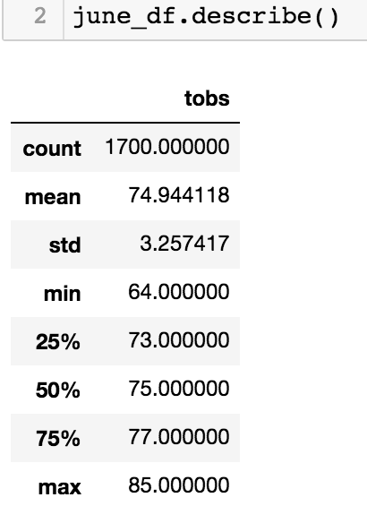
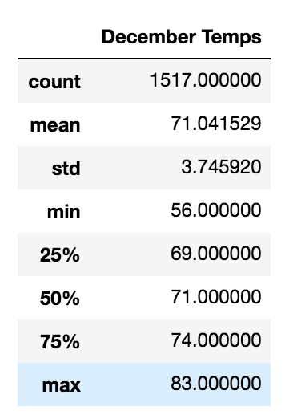

# surfs_up
Checking temperatures to see if a location is good to start a new shop.

## Overview of Analysis
This analysis was performed to determine if a location in Oahu is suitable to set up a surf and shakes shop. The temperature and precipitation were checked from weather data obtained for several years. This analysis particularly looks at temperatures for the months of June and December to see if the location is satisfactory year round.

## Results
Some information this analysis shows us:
- June is temperate with a range of 64°F - 85°F, and a mean of 75°F.

- December is somewhat cooler but still fairly comfortable with a range of 56°F - 83°F, and a mean of 71°F.

- The temperatures in December average 4°F less than in June.

## Summary
This analysis shows that even in December the temperatures are warm enough that people would remain likely to want to purchase surfing equipment and shakes. 

It does not however show anything in regards to precipitation for those months, which is one of the additional queries that would be useful to have. One would just change tobs to prcp for this change.

Another potentially useful query would be knowing the exact location or station where these data are observed. Is there a better location in Oahu? Or perhaps elsewhere in Hawaii?
