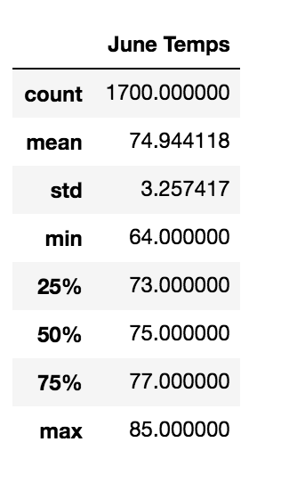

# surfs_up
Checking temperatures to see if a location is good to start a new shop.

## Overview of Analysis
This analysis was performed to determine if a location in Oahu is suitable to set up a surf and shakes shop. The temperature and precipitation were checked from weather data obtained for several years. This analysis particularly looks at temperatures for the months of June and December to see if the location is satisfactory year round.

## Results

